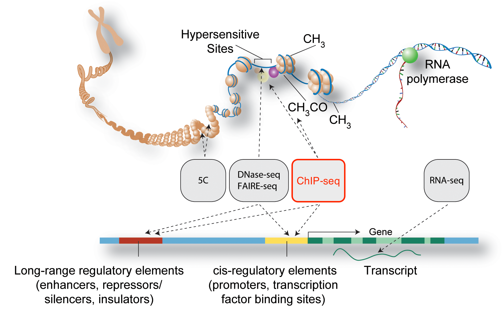
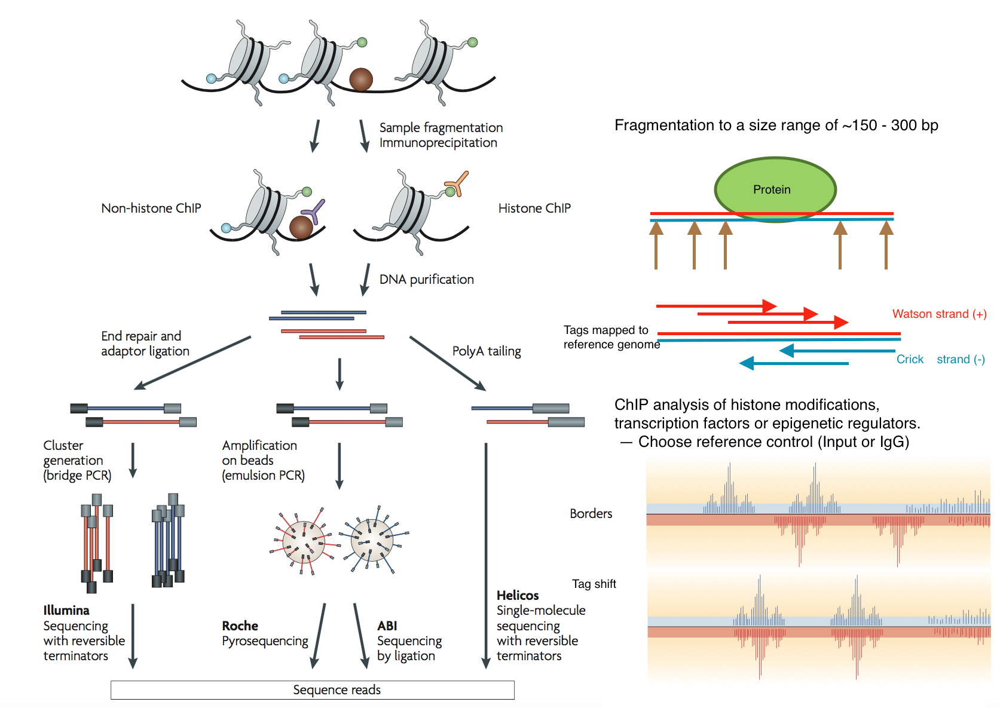
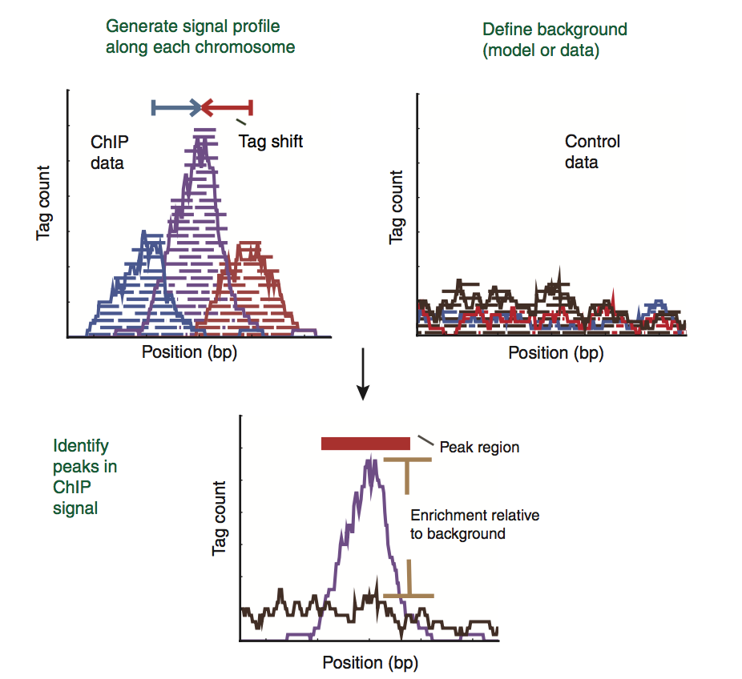
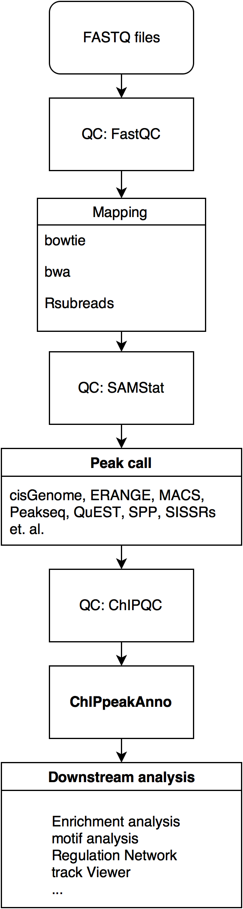
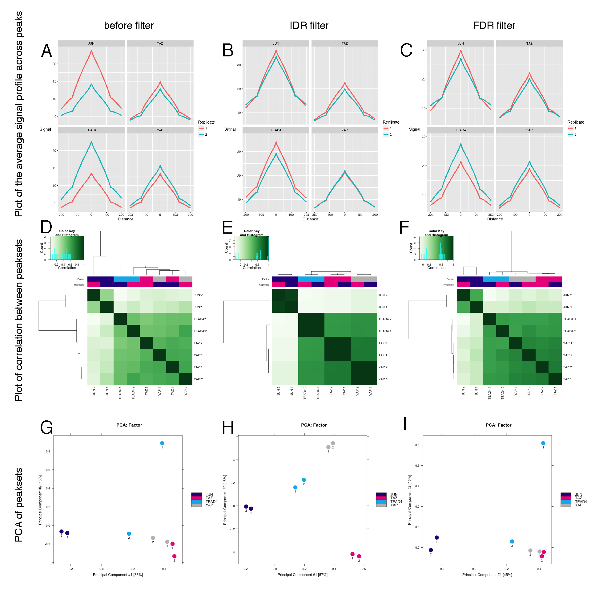
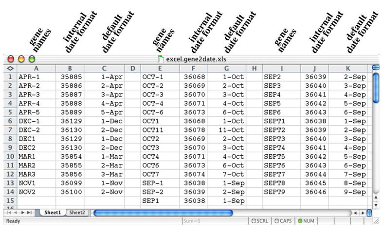

## Prerequisites
- You are bioinformatician or major in bioinformatics
- R(>= 3.4)/Bioconductor(>= 3.5) installed
- Installed following packages

     |      |       
------------------------------|---------------------------|-----------------------
[ChIPpeakAnno](http://www.bioconductor.org/packages/release/bioc/html/ChIPpeakAnno.html) | [SRAdb](http://www.bioconductor.org/packages/release/bioc/html/SRAdb.html) | [Rsubread](http://www.bioconductor.org/packages/release/bioc/html/Rsubread.html)
[GeneNetworkBuilder](http://www.bioconductor.org/packages/release/bioc/html/GeneNetworkBuilder.html) | [GEOquery](https://www.bioconductor.org/packages/release/bioc/html/GEOquery.html) | [Rsamtools](http://www.bioconductor.org/packages/release/bioc/html/Rsamtools.html)
[trackViewer](http://www.bioconductor.org/packages/release/bioc/html/trackViewer.html) | [rtracklayer](http://www.bioconductor.org/packages/release/bioc/html/rtracklayer.html) | [GenomicAlignments](http://www.bioconductor.org/packages/release/bioc/html/GenomicAlignments.html)
[motifStack](http://www.bioconductor.org/packages/release/bioc/html/motifStack.html) | [ChIPQC](http://www.bioconductor.org/packages/release/bioc/html/ChIPQC.html) | [csaw](http://www.bioconductor.org/packages/release/bioc/html/csaw.html)
[BSgenome.Hsapiens.UCSC.hg19](http://www.bioconductor.org/packages/release/bioc/html/BSgenome.Hsapiens.UCSC.hg19.html) | [org.Hs.eg.db](http://www.bioconductor.org/packages/release/bioc/html/org.Hs.eg.db.html) | [reactome.db](http://www.bioconductor.org/packages/release/bioc/html/reactome.db.html)
[TxDb.Hsapiens.UCSC.hg19.knownGene](http://www.bioconductor.org/packages/release/bioc/html/TxDb.Hsapiens.UCSC.hg19.knownGene.html) |  |


```{r echo=FALSE, results="hide", warning=FALSE, message=FALSE}
suppressPackageStartupMessages({
    library(SRAdb)
    library(reshape2)
    library(Rsubread)
    library(Rsamtools)
    library(ChIPpeakAnno)
    library(GeneNetworkBuilder)
    library(rtracklayer)
    library(GenomicAlignments)
    library(idr)
    library(ChIPQC)
    library(csaw)
    library(ggplot2)
    library(TxDb.Hsapiens.UCSC.hg19.knownGene)
    library(org.Hs.eg.db)
    library(reactome.db)
    library(BSgenome.Hsapiens.UCSC.hg19)
    library(motifStack)
    library(knitr)
    library(trackViewer)
    library(png)
    library(grid)
    library(limma)
    library(simpIntLists)
    library(plotly)
    library(Rgraphviz)
})
opts_chunk$set(eval=FALSE, fig.width=8, fig.height=8, warning = FALSE, message = FALSE)
extdata <- system.file("extdata", package = "ChIPseqStepByStep")
load(file.path(extdata, "minimal.rds"))
```

## What is ChIP-seq {.small-font}

> Chromatin immunoprecipitation followed by sequencing (ChIP-seq) is a 
> technique for genome-wide profiling of DNA-binding proteins, histone 
> modifications or nucleosomes.
>
>  -- *Peter J. Park*



(Modified from PLoS Biol 9-e1001046,2001 M.Pazin)

## ChIP-seq experiment workflow



(Modified from Nature Reviews Genetics doi:10.1038/nrg2641, P.Park)

## Call peaks



(Modified from Nature Methods doi:10.1038/nmeth.1371, S.Pepke)

## ChIP-seq data analysis workflow
<div class="left">

</div>

<div class="right">
* Quality Control: [FastQC](http://www.bioinformatics.babraham.ac.uk/projects/fastqc/), [ChIPQC](http://www.bioconductor.org/packages/release/bioc/html/ChIPQC.html)

* mapping: [bowtie1/2](http://bowtie-bio.sourceforge.net/index.shtml)

* view tracks: [IGV](https://www.broadinstitute.org/igv/home), [UCSC genome browser](http://genome.ucsc.edu/cgi-bin/hgTracks?db=hg38), [rtracklayer](http://www.bioconductor.org/packages/release/bioc/html/rtracklayer.html), [trackViewer](http://www.bioconductor.org/packages/release/bioc/html/trackViewer.html)

* peak calling: (Modified from Nature Immunology doi:10.1038/ni.2117, B.Kidder)

|   | Type of peak | Example | Representative tools |
|---|--------------|---------|----------------------|
| | broad | H3K27me3 | [CCAT](http://cmb.gis.a-star.edu.sg/ChIPSeq/paperCCAT.htm), [SICER](http://home.gwu.edu/~wpeng/Software.htm) |
| | Sharp | CTCF | [MACS](http://liulab.dfci.harvard.edu/MACS/) |
| | Sharp & broad | Pol II | [ZINBA](https://code.google.com/p/zinba/) |

* annotation and enrichment analysis: [ChIPpeakAnno](http://www.bioconductor.org/packages/release/bioc/html/ChIPpeakAnno.html), [ChIPseeker](http://www.bioconductor.org/packages/release/bioc/html/ChIPseeker.html)

* sequence logo: [The MEME Suite](http://meme.nbcr.net/meme/index.html), [homer](http://homer.salk.edu/homer/motif/)
</div>

## About the workflow

The workflow is based primarily on software packages from the open-source [Bioconductor project](http://bioconductor.org/). It contains all steps that are necessary for detecting peaks, starting from the raw read sequences. 

Reads are first aligned to the genome using the **[Rsubread](http://bioconductor.org/packages/release/bioc/html/Rsubread.html)** package. 

Peaks are called by **[MACS2](https://github.com/taoliu/MACS/)**. 

The peaks were annotated and virualized by **[ChIPpeakAnno](http://bioconductor.org/packages/release/bioc/html/ChIPpeakAnno.html)** and **[trackViewer](http://bioconductor.org/packages/release/bioc/html/trackViewer.html)** packages.

The application of the methods will be demonstrated on a publicly available ChIP-seq data sets. The data set studies genome-wide association between YAP/TAZ/TEAD peaks at enhancers drives oncogenic growth (Zanconato et al., 2015). The intention is to provide readers with a full usage example from which they can construct analysis of their own data.

## Download data from Gene Expression Omnibus

NCBI GEO ID | SRA project | Description                                                                              
------------|-------------|-------------------------------------------------------------------------------------------
GSE66081    | SRP055170   | the data of ChIP-seq raw reads for the study of association between YAP/TAZ/TEAD and AP-1 at enhancers drivers oncogenic trowth
GSE49651    |             | the H3K27Ac, H3K4me1, H3K4me3 ChIP-seq data in breast cancer cell line
GSE59232    |             | transcriptomic data of Affymetrix GeneChips Human Genome U133 Plus 1.0

***

Here we use **[SRAdb](http://bioconductor.org/packages/release/bioc/html/SRAdb.html)** package to download the sequence data.

```{r eval=FALSE}
## load library SRAdb to retrieve SRA files for GSE66081 dataset
library(SRAdb)
## SRAdb need to download a light sqlite file 
## to extract sra file information
## and then download by getSRAfile function.
sqlfile <- "SRAmetadb.sqlite"
if(!file.exists(sqlfile)) 
    sqlfile <- getSRAdbFile()
sra_con <- dbConnect(SQLite(), sqlfile)
conversion <- sraConvert(c("SRP055170"), 
                         sra_con=sra_con)
out <- getSRAfile(conversion$sample, 
                  sra_con=sra_con, 
                  fileType="sra")
```

***

```{r eval=FALSE}
## extract file annotations
rs <- listSRAfile(conversion$sample, 
                  sra_con=sra_con, 
                  fileType="sra")
experiment <- 
    dbGetQuery(sra_con, 
               paste0("select * from experiment where",
                      " experiment_accession in ('",
                      paste(conversion$experiment, 
                            collapse="','"), "')"))
info <- merge(experiment[, c("experiment_accession", 
                             "title", "library_layout")], 
              rs[, c("experiment", "run")], by=1)
```
```{r eval=TRUE}
info[1:5, 2:3]
```

   
***

These files are downloaded in the SRA format, and need to be unpacked to the FASTQ format prior to alignment. This can be done using the _fastq-dump_ utility from **[SRA Toolkit](http://www.ncbi.nlm.nih.gov/books/NBK158900/)**.

```{r eval=FALSE}
runs <- info[, "run"]
## extract fastq files from sra by sratoolkit
sapply(paste0(runs, ".sra"), 
       function(.ele) system(paste("fastq-dump", 
                                   .ele)))
```

***

Technical replicates are merged together prior to further processing. This reflects the fact that they originate from a single library of DNA fragments.

```{r eval=FALSE}
grp <- do.call(rbind, 
               strsplit(info$title, "(;|:) "))
info <- cbind(info, grp)
runs <- split(runs, grp[, 2])
group <- gsub("_ChIPSeq", "", names(runs))
```
```{r eval=TRUE}
runs[1:2]
```

```{r eval=FALSE}
mapply(function(.ele, n) 
    system(paste("cat", paste0(.ele, ".fastq", collapse=" "), 
                 ">>",  paste0(n, ".fastq"), collapse=" ")), 
       runs, group)
## remove unused files to save storage.
unlink(paste0(info$run, ".fastq"))
unlink(paste0(info$run, ".sra"))
```

## Aligning reads to hg19 build of human genome

Reads in each library are aligned to the hg19 build of human genome, using the **[Rsubread](http://bioconductor.org/packages/release/bioc/html/Rsubread.html)** package. 

```{r eval=FALSE}
library(Rsubread)
fastq.files <- paste0(group, ".fastq")
bam.files <- paste0(group, ".bam")

##getPhredOffset, if the offset is not correct, it will report error.
x <- qualityScores(filename=fastq.files[1], 
                   input_format="FASTQ", offset=33)
```
```{r eval=TRUE}
x[1:3, 1:10]
```

***

An index is constructed with the prefix index/hg19 and the index can be re-used. Here, the `type` of sequencing data is set to 1 for genomic DNA-seq data. The uniquely mapped reads should be reported only by setting the `uniqe` to TRUE.

```{r eval=FALSE}
## build index and this can be re-used.
hg19.fasta <- 
    "Genomes/UCSC/hg19/Sequence/WholeGenomeFasta/genome.fa"
dir.create("index")
buildindex(basename="index/hg19",
           reference=hg19.fasta)

## alignment
align(index="./index/hg19", readfile1=fastq.files, 
      type=1, 
      output_file=bam.files, maxMismatches=2, 
      nthreads=2, 
      phredOffset=33, unique=TRUE)
```

***

Subsample the data to save time for this tutorial.
```{r eval=FALSE}
library(Rsamtools)
filter <- FilterRules(list(seqn = function(x) x$rname == "chr1"))
## sort and index
null <- sapply(group, function(gp) {
    sortBam(paste0(gp, ".bam"), paste0(gp, ".srt"))
    file.copy(paste0(gp, ".srt.bam.bam"), 
              paste0(gp, ".bam"), overwrite = TRUE)
    indexBam(paste0(gp, ".bam"))
})
## subset
null <- sapply(group, function(gp) {
    dest <- paste0(gp, ".chr1.bam")
    filterBam(paste0(gp, ".bam"), paste0(gp, ".chr1.bam"), 
              filter=filter)
    file.rename(paste0(gp, ".chr1.bam"), paste0(gp, ".bam"))
    indexBam(paste0(gp, ".bam"))
})
```

   
***

Potential PCR duplicates are removed by _removeDupReads_ function in **[Rsubread](http://bioconductor.org/packages/release/bioc/html/Rsubread.html)** package. This step can be also done by _MarkDuplicates_ tool from the [Picard software suite](http://broadinstitute.github.io/picard/). 

By _asBam_ function from **[Rsamtools](http://bioconductor.org/packages/release/bioc/html/Rsamtools.html)** package, the alignment is sorted by their mapping location, and an index created on the destination (with extension '.bai') when `indexDestination=TRUE`.

```{r eval=FALSE}
## remove reads which are mapped to identical locations, 
## using mapping location of the first base of each read.
## and resort by position
library(Rsamtools)
library(Rsubread)
null <- sapply(group[c(1, 11:13)], function(gp){
    out <- asSam(paste0(gp, ".bam"), gp)
    removeDupReads(out, threshold=2, 
                   outputFile=paste0(gp, ".rmdup.sam"))
    asBam(paste0(gp, ".rmdup.sam"), paste0(gp, ".rmdup"), 
          indexDestination=TRUE)
    unlink(out)
    unlink(paste0(gp, ".rmdup.sam"))
})
```

## Calling peaks

The control datasets are pooled before calling peaks according the description of the paper.

```{r eval=FALSE}
## pool IgG depend on experiment
IgG.bg <- list(rep1.2=c("IgG_rep1.rmdup.bam", 
                        "IgG_rep2.rmdup.bam", 
                        "IgG_rep1.2.rmdup.bam"),
                rep3.4=c("IgG_rep3.rmdup.bam", 
                         "IgG_rep4.rmdup.bam", 
                         "IgG_rep3.4.rmdup.bam"),
                rep3.5=c("IgG_rep3.rmdup.bam", 
                         "IgG_rep5.rmdup.bam", 
                         "IgG_rep3.5.rmdup.bam"))
null <- sapply(IgG.bg[3], function(.ele){
    out <- mergeBam(files=.ele[-3],
                    destination = .ele[3], 
                    indexDestination=TRUE)
})
```

***

Before we call peaks, we may want to check the difference between ChIP signal and background signal.

By `ChIPpeakAnno::cumulativePercentage` function, the difference between the cumulative percentage 
tag allocation in Input and IP could be clearly checked (??ref).

```{r eval=FALSE}
library(ChIPpeakAnno)
library(TxDb.Hsapiens.UCSC.hg19.knownGene)
pair <- data.frame(treat=c("YAP", "TAZ", "TEAD4", "JUN"),
                   control=c("1.2", "1.2", "3.4", "3.5"),
                   stringsAsFactors = FALSE)
# use chromosome 1 to save the time.
chr1 <- as(seqinfo(TxDb.Hsapiens.UCSC.hg19.knownGene)["chr1"], "GRanges")
# check the difference between TEAD4 ChIP and background signal
i <- 3 
cumulativePercentage(
        bamfiles = c(paste0(pair[i, "treat"], 
                            "_rep1.rmdup.bam"),
                     paste0("IgG_rep", pair[i, "control"], 
                            ".rmdup.bam")), 
        gr=chr1)
```

***

See documentation from [deeptools](http://deeptools.readthedocs.io/en/latest/content/tools/plotFingerprint.html)


***

We set loose filter condition for [MACS2](https://github.com/taoliu/MACS/) to get more peaks for irreproducibility discovery rate (IDR) analysis.

```{r eval=FALSE}
for(i in seq.int(nrow(pair))){
    system(paste("macs2 callpeak --to-large -t", 
                 paste0(pair[i, "treat"], "_rep1.rmdup.bam"), 
                 "-c ", paste0("IgG_rep", pair[i, "control"], ".rmdup.bam"), 
                 " -f BAM -g hs -q 0.1 -n", 
                 paste0(pair[i, "treat"], "_rep1.q1")))
    system(paste("macs2 callpeak --to-large -t", 
                 paste0(pair[i, "treat"], "_rep2.rmdup.bam"), 
                 "-c ", paste0("IgG_rep", pair[i, "control"], ".rmdup.bam"), 
                 " -f BAM -g hs -q 0.1 -n", 
                 paste0(pair[i, "treat"], "_rep2.q1")))
    ## we will use idr to filter the results later
}
```

***

After peak calling, the output of [MACS2](https://github.com/taoliu/MACS/) will be import into R by `ChIPpeakAnno::toGRanges` function. The top 10000 peaks sorted by pValue (FDR) will be used for IDR analysis. 

```{r eval=FALSE, warning=FALSE}
library(ChIPpeakAnno)
macs2.files <- dir(".", pattern="*.q1_peaks.narrowPeak$")
peaks <- sapply(macs2.files, function(.ele) 
    toGRanges(.ele, format="narrowPeak"))
peaks.bk <- peaks
peaks <- lapply(peaks, function(.ele) 
    .ele[order(.ele$pValue, decreasing=TRUE)])
```

***

There are lots of noise peaks when we set loose filter condition for [MACS2](https://github.com/taoliu/MACS/). We will use IDR framework to filter the low reproducible peaks. Only overlapping peaks will be used for IDR calculation.

```{r eval=TRUE}
peaks <- lapply(peaks, function(.ele) .ele[1:min(1e5, length(.ele))])
lengths(peaks)
```

***

```{r eval=FALSE}
new.group <- gsub("^(.*?)_.*$", "\\1", names(peaks))
peaks.grp <- split(peaks, new.group)
names(peaks.grp)
## find overlapping peaks
GSE66081 <- sapply(peaks.grp, findOverlapsOfPeaks, simplify = FALSE)
GSE66081.bk <- GSE66081
GSE66081 <- sapply(GSE66081, function(.ele)
    .ele$peaklist[[names(.ele$peaklist)[grepl("\\/\\/\\/", 
                                        names(.ele$peaklist))]]],
                   simplify=FALSE)
```
```{r eval=TRUE}
lengths(GSE66081)
```

***

The IDR are calculated by the average coverages of each overlapping peak. The reads counts for peaks are done by _summarizeOverlaps_ function in **[GenomicAlignments](https://www.bioconductor.org/packages/release/bioc/html/GenomicAlignments.html)** package.

```{r eval=FALSE}
library(ChIPpeakAnno)
new.group.names <- lapply(GSE66081.bk, function(.ele) 
    sub(".q1_peaks.narrowPeak", ".bam", 
        names(.ele$peaklist)[!grepl("\\/\\/\\/", names(.ele$peaklist))]))
GSE66081 <- mapply(function(.peaks, .bamfiles) 
    IDRfilter(peaksA=.peaks[[1]], peaksB=.peaks[[2]],
              bamfileA=.bamfiles[1], bamfileB=.bamfiles[2],
              IDRcutoff=0.01),
    peaks.grp, new.group.names)
## The original peaks are filtered to decrease the memory usage.
peaks.keep <- sapply(GSE66081, function(.ele) 
    as.character(unlist(.ele$peakNames)))
peaks.keep <- lapply(peaks.keep, function(.ele) gsub("^.*__", "", .ele))
peaks.keep <- unlist(peaks.keep)
peaks.s <- lapply(peaks, function(.ele) .ele[names(.ele) %in% peaks.keep])
peaks.unlist <- unlist(GRangesList(peaks.s), use.names = FALSE)
```

## Export filtered peaks by `rtracklayer`

Export the filtered peak by _export_ function in **[rtracklayer](https://www.bioconductor.org/packages/release/bioc/html/rtracklayer.html)** package. 

```{r eval=FALSE}
library(rtracklayer)
null <- mapply(function(.dat, .name) 
    export(.dat, 
           sub("^(.*?).q1.*$", "\\1.fil.bed", .name),
           format="BED"), 
    peaks.s, names(peaks.s))
## filter the peaks by qValue < 10^-10 to get similar number peaks 
## as filtered by idr to confirm the effect of IDR filter.
peaks.bk <- lapply(peaks.bk, function(.ele) 
    .ele[.ele$qValue>10])
null <- mapply(function(.dat, .name) 
    export(.dat, 
           sub("^(.*?).q1.*$", "\\1.fil.q01.bed", .name),
           format="BED"), 
    peaks.bk, names(peaks.bk))
```


## Quality control

The ChIP-seq experiment could be checked by [ChIPQC](http://bioconductor.org/packages/release/bioc/html/ChIPQC.html) package. 

Usally, before mapping, [FastQC](http://www.bioinformatics.babraham.ac.uk/projects/fastqc/) could be used for sequence quality accessment. And after mapping, [SAMStat](http://samstat.sourceforge.net/) could be used for mapping quality analysis, and strand cross-correlation could be sued for checking the experiment quality via [csaw](http://bioconductor.org/packages/release/bioc/html/csaw.html) package. 

```{r eval=FALSE}
## strand cross-correlation
library(csaw)
scc <- lapply(sub("^(.*?).q1.*$", "\\1.rmdup.bam", names(peaks)),
              correlateReads, cross=TRUE,
              param=readParam(minq=30, 
                              restrict="chr1",
                              dedup=TRUE))
names(scc) <- gsub(".q1.*$", "", names(peaks))
scc.param <- lapply(scc, function(.ele){
    readsLength <- 50
    cutline <- 2 * readsLength
    read_length <- which.max(.ele[1:cutline])
    fragment_length <- which.max(.ele[cutline:length(.ele)]) + cutline - 1
    baseline <- which.min(.ele[cutline:length(.ele)]) + cutline - 1
    #normalized.strand.coefficient
    NSC <- .ele[fragment_length] / .ele[baseline] 
    # relative strand correlation
    RSC <- (.ele[fragment_length] - .ele[baseline])/(.ele[read_length] - .ele[baseline]) 
    c(read_length=read_length-1,
      fragment_length=fragment_length-1,
      baseline=baseline-1,
      NSC=NSC, 
      RSC=RSC)
})
```

***

The normalized strand coefficient (NSC) and relative strand correlation (RSC) are strong metrics for assessing signal-to-noise ratios in a ChIP-seq experiment. High-quality ChIP-seq data sets should have NSC values >= 1.05 and RSC values >= 0.8 (Landt et al., 2012). 

```{r eval=TRUE}
do.call(rbind, scc.param)[, c("NSC", "RSC")]
```

## Strand cross correlation against delay distance

The absolute and relative height of 'phantom' peak and ChIP peak are useful determinants of the success of a ChIP-seq experiment.

```{r eval=FALSE}
op <- par(mfrow=c(4, 2))
for(i in 1:length(scc)){
    plot(1:length(scc[[i]])-1, scc[[i]], 
         xlab="Delay (bp)", ylab="cross-correlation", 
         main=names(scc)[i], type="l", 
         ylim=c(scc[[i]][scc.param[[i]]["baseline"]]*.8, max(scc[[i]])*1.1))
    abline(v=scc.param[[i]]["fragment_length"], col="red", lty=3)
    abline(h=scc[[i]][scc.param[[i]][c("fragment_length", "read_length", "baseline")]+1], 
           col=c("blue", "green", "gray30"), lty=2)
}
```

***

```{r eval=TRUE, fig.width=6, fig.height=9, echo=FALSE}
op <- par(mfrow=c(4, 2))
for(i in 1:length(scc)){
    plot(1:length(scc[[i]])-1, scc[[i]], 
         xlab="Delay (bp)", ylab="cross-correlation", 
         main=names(scc)[i], type="l", 
         ylim=c(scc[[i]][scc.param[[i]]["baseline"]]*.8, max(scc[[i]])*1.1))
    abline(v=scc.param[[i]]["fragment_length"], col="red", lty=3)
    abline(h=scc[[i]][scc.param[[i]][c("fragment_length", "read_length", "baseline")]+1], 
           col=c("blue", "green", "gray30"), lty=2)
}
```

## Generate bigWig files for UCSC genome browser

Now we have estimated fragment length and can generate track files for UCSC genome browser. 
```{r eval=FALSE}
library(GenomicAlignments)
library(rtracklayer)
bwPath <- "bw"
dir.create(bwPath)
cvgs <- mapply(function(.ele, .name){
    gal <- readGAlignments(paste0(.name, ".rmdup.bam"))
    cvg <- coverage(gal, width = as.numeric(.ele["fragment_length"]))
    seqinfo(cvg) <- seqinfo(TxDb.Hsapiens.UCSC.hg19.knownGene)
    export.bw(cvg, 
              con=file.path(bwPath, 
                            paste0(.name, ".rmdup.bigWig")))
    cvg
}, scc.param, names(scc.param))
```

***

[ChIPQC](http://bioconductor.org/packages/release/bioc/html/ChIPQC.html) is used for quality control.

```{r eval=TRUE}
library(ChIPQC)
samples <- 
    data.frame(SampleID=gsub("^(.*?).q1.*$", "\\1", names(peaks)), 
               Factor=gsub("^(.*?)_.*$", "\\1", names(peaks)),
               Replicate=gsub("^.*?_rep(.*?).q1.*$", "\\1", 
                              names(peaks)),
               bamReads=gsub("^(.*?).q1.*$", "\\1.rmdup.bam", 
                             names(peaks)),
               Peaks=names(peaks),
               PeakCaller="narrow")
samples
```

***

We run ChIPQC for peaks before filter, filtered by IDR and filtered by qValue.

```{r eval=FALSE}
## before filter
exampleExp <- ChIPQC(experiment=samples, annotaiton="hg19")
ChIPQCreport(exampleExp, reportFolder="ChIPQC", facetBy="Factor")
## after IDR filter
samples.fil <- samples
samples.fil$Peaks <- gsub("^(.*?).q1.*$", "\\1.fil.bed", names(peaks))
samples.fil$PeakCaller="bed"
exampleExp.fil <- ChIPQC(experiment=samples.fil, annotaiton="hg19")
ChIPQCreport(exampleExp.fil, 
             reportFolder="ChIPQC.fil", 
             facetBy="Factor")
## filtered by qValue from the MACS2 result
samples.fil.q01 <- samples.fil
samples.fil.q01$Peaks <- 
    gsub("^(.*?).q1.*$", "\\1.fil.q01.bed", names(peaks))
exampleExp.fil.q01 <- ChIPQC(experiment=samples.fil.q01, 
                             annotaiton="hg19")
ChIPQCreport(exampleExp.fil.q01, 
             reportFolder="ChIPQC.fil.q01", 
             facetBy="Factor")
```

***



The effect of IDR with full dataset. The average profile across within peak regions of duplicates, and the correlation between samples as heatmap and by principal component analysis show higher quality of IDR filtered peaks for replicate samples because that they are clustered together in the heatmap and spatially grouped within the PCA plot.


## Association among different sets of peaks

Test the overlaps of all the peaks. From the testing result, we can confirm the widespread association between YAP, TAZ, TEAD and JUN. The vennDiagram shows the numbers of overlapping peak for these TFs. 
```{r eval=FALSE}
ol <- findOverlapsOfPeaks(GSE66081, connectedPeaks="keepAll")
```
```{r eval=TRUE, message=FALSE, warning=FALSE, fig.width=5, fig.height=5}
makeVennDiagram(ol)
```

***

We want to confirm that not only the peaks are overlapped but also their summits are close to each other.

```{r eval=FALSE}
peaks.summit <- lapply(peaks, function(.ele) {
    .ele <- shift(.ele, .ele$peak)
    width(.ele) <- 1
    .ele
})

TEAD.summit <- unlist(GRangesList(peaks.summit[new.group=="TEAD4"]))
TAZ.summit <- unlist(GRangesList(peaks.summit[new.group=="TAZ"]))
bof <- binOverFeature(TEAD.summit, 
                      annotationData=TAZ.summit, 
                      radius=300, nbins=300, FUN=length)
```

***

```{r eval=TRUE, message=FALSE, warning=FALSE, fig.width=5, fig.height=5}
plot(as.numeric(rownames(bof)), bof, 
     ylab="Peak density", 
     xlab="Distance to the summit of TAZ peaks", 
     main="Position of TEAD4 peak summit", 
     type="l", xlim=c(-300, 300))
```

## Steps of annotation by `ChIPpeakAnno`

The functions, `toRanges`, `annotatePeakInBatch`, and  `addGeneIDs` in the ChIPpeakAnno, 
the annotation of ChIP-Seq peaks becomes streamlined into four major steps:

1. Read peak data with `toGRanges` 

2. Generate annotation data with `toGRanges` 

3. Annotate peaks with `annotatePeakInBatch` 

4. Add additional informations with `addGeneIDs`

## Prepare annotation data

Annotation data should be an object of **GRanges**. Same as import peaks, we use the method `toGRanges`, which can return an object of **GRanges**, to represent the annotation data. 
An annotation data be constructed from not only BED, GFF or user defined readable text files, 
but also **EnsDb** or **TxDb** object, by calling the `toGRanges` method. 
Please type `?toGRanges` for more information.

```{r eval=FALSE}
library(TxDb.Hsapiens.UCSC.hg19.knownGene)
annoData <- toGRanges(TxDb.Hsapiens.UCSC.hg19.knownGene, feature="gene")
```
```{r eval=TRUE}
annoData[1]
```


## Check distribution of peaks

The distribution of peaks over exon, intron, enhancer, proximal promoter, 5'UTR and 3'UTR could give you some clues how to annotate the peaks. The distribution can be summarized in the peak centric or nucleotide centric view using the function _assignChromosomeRegion_ in [ChIPpeakAnno](http://bioconductor.org/packages/release/bioc/html/ChIPpeakAnno.html) package.

```{r eval=FALSE}
overlaps <- ol$peaklist[["TAZ///TEAD4///YAP"]]
seqlevelsStyle(overlaps) ## == UCSC
aCR<-assignChromosomeRegion(overlaps, nucleotideLevel=FALSE,
                            TxDb=TxDb.Hsapiens.UCSC.hg19.knownGene)
```

***

```{r eval=TRUE, message=FALSE, warning=FALSE, fig.width=9, fig.height=4.5}
par(mar=c(10.1, 4.1, 4.1, 2.1))
barplot(aCR$percentage, las=3)
```


## Annotate by `annotatePeakInBatch`

The chromosome distribtuion of the overlapping peaks shows that many of the peaks are located in intergeic regions. Then we use _annotedPeakInBatch_ or _annoPeaks_ function in **[ChIPpeakAnno](http://bioconductor.org/packages/release/bioc/html/ChIPpeakAnno.html)** package to annotate the peaks by most close features in both sides of the peaks. Because most of the peaks are far from TSS, we set the `bindingRegion` a very big region (100K).

```{r eval=FALSE}
## annotate the peaks by nearest annotations.
YAP.TAZ.TEAD4.nearest <- 
    annotatePeakInBatch(overlaps, 
                        AnnotationData=annoData)

## annotate the peaks by both side in a given range.
YAP.TAZ.TEAD4.2side <- 
    annotatePeakInBatch(overlaps, 
                        AnnotationData=annoData, 
                        output="nearestBiDirectionalPromoters", 
                        bindingRegion=c(-100000, 100000))
```

***

```{r eval=TRUE, message=FALSE, warning=FALSE, fig.width=4.5, fig.height=4.5}
pie1(table(YAP.TAZ.TEAD4.2side$insideFeature))
```

## Add gene symbols by `addGeneIDs`

```{r eval=TRUE}
library(org.Hs.eg.db)
YAP.TAZ.TEAD4.nearest.anno <-
    addGeneIDs(annotatedPeak = YAP.TAZ.TEAD4.nearest,
           orgAnn = org.Hs.eg.db,
           feature_id_type = "entrez_id")
YAP.TAZ.TEAD4.nearest.anno[1:3]
```

## Save annotation results

The annotations could be saved in XLS file by **[WriteXLS](https://cran.r-project.org/web/packages/WriteXLS/index.html)** package to avoid the gene name errors that be introduced inadvertently when using Excel (Zeeberg et al., 2004). 

```{r eval=FALSE}
## save annotations
YAP.TAZ.TEAD4.2side.m <- as.data.frame(unname(YAP.TAZ.TEAD4.2side))
YAP.TAZ.TEAD4.2side.m$peakNames <- NULL
library(WriteXLS)
WriteXLS("YAP.TAZ.TEAD4.2side.m", 
         "YAP.TAZ.TEAD4.overlapping.peaks.anno.xls")
```



## Enrichment analysis

With the annotated peak data, you can call the function `getEnrichedGO` to obtain a list of enriched GO terms. Please note that the default setting of `feature_id_type` is "ensembl\_gene\_id". If you are using _TxDb_ as annotation data, please try to change it to "entrez\_id".


```{r eval=FALSE}
## enrichment analysis
library(org.Hs.eg.db)
over <- getEnrichedGO(YAP.TAZ.TEAD4.2side, 
                      orgAnn="org.Hs.eg.db", 
                      feature_id_type="entrez_id", 
                      maxP=.01, condense=TRUE)
```
```{r eval=TRUE, message=FALSE, warning=FALSE}
head(over[["bp"]][, -c(3, 10)])
dim(over[["bp"]])
```

***

For pathway analysis, you can call function `getEnrichedPATH` using reactome or KEGG database.

```{r eval=FALSE}
library(reactome.db)
path <- getEnrichedPATH(YAP.TAZ.TEAD4.2side, 
                        orgAnn="org.Hs.eg.db", 
                        pathAnn="reactome.db", 
                        feature_id_type="entrez_id", 
                        maxP=.05)
```
```{r eval=TRUE, message=FALSE, warning=FALSE}
head(path)
```

## Bidirectional promoters

Bidirectional promoters are the DNA regions located between the 5' ends of two adjacent genes coded on opposite strands. The two adjacent genes are transcribed to the opposite directions, and often co-regulated by this shared promoter region(Robertson et al., 2007). Here is an example to find peaks with bi-directional promoters and output the percentage of the peaks near bi-directional promoters.

```{r eval=FALSE}
bdp <- peaksNearBDP(overlaps, annoData, MaxDistance=100000)
```
```{r eval=TRUE, message=FALSE, warning=FALSE}
bdp
```

## View tracks by `trackViewer`

The peaks could be visualized by **[trackViewer](http://bioconductor.org/packages/release/bioc/html/trackViewer.html)** package.

```{r eval=FALSE}
library(trackViewer)
gene <- "SYDE2"
eID <- mget(gene, org.Hs.egSYMBOL2EG)
gr <- as(annoData[eID[[1]]], "GRanges")
gr.promoter <- promoters(gr, upstream=5000, downstream=2000)
seqlevels(gr.promoter) <- "chr1"
seqinfo(gr.promoter) <- seqinfo(gr.promoter)["chr1"]
bams.rep1 <- sub(".bam", ".rmdup.bam", 
                 bam.files[grepl("rep1", bam.files)])
syde <- lapply(bams.rep1, importBam, ranges=gr.promoter)
names(syde) <- gsub("_rep1.rmdup.bam", "", bams.rep1)
trs <- geneModelFromTxdb(TxDb.Hsapiens.UCSC.hg19.knownGene, 
                         orgDb = org.Hs.eg.db, gr = gr.promoter)
trs.names <- sapply(trs, function(.ele) .ele@name)
trs <- trs[match(gene, trs.names)]
names(trs) <- gene
optSty <- optimizeStyle(trackList(syde, trs, heightDist=c(.9, .1)), 
                        theme="col")
trackList <- optSty$tracks
viewerStyle <- optSty$style
for(i in 1:length(trackList)) 
    setTrackStyleParam(trackList[[i]], "ylabgp", list(cex=.8))
```

***

```{r eval=TRUE, fig.width=12, fig.height=8}
vp <- viewTracks(trackList, gr=gr.promoter, 
                 viewerStyle=viewerStyle)
```

***
Too complicated? Try `browseTracks`

```{r eval=TRUE}
browseTracks(trackList, gr=gr.promoter)
```

## Discover the binding pattern

Owing to most of the peaks are in the intergenic regions, we questioned whether most YAP/TAZ/TEAD common peaks are located in enhancers. Enhancers can be distinguished from promoters by their epigenetic features, that is, relative enrichment of histone H3 monomethylation (H3K4me1) on Lys4 at enhancers, and trimethylation (H3K4me3) at promoters. We first determine the distribution of the distance between the peaks and known genes. And then check the correlation of peaks and enhancers.

```{r eval=FALSE}
dist2TSS <- 
    lapply(list(YAP=GSE66081[["YAP"]],
                TAZ=GSE66081[["TAZ"]],
                TEAD4=GSE66081[["TEAD4"]],
                YAP.TAZ.TEAD4=ol$peaklist[["TAZ///TEAD4///YAP"]]),
           function(.ele) {
               .ele <- annotatePeakInBatch(.ele, 
                                           AnnotationData=annoData,
                                           output="nearestLocation")
               .ele$shortestDistance})
```

***

```{r eval=FALSE}
dist2TSS.cut <- lapply(dist2TSS, cut, breaks=c(0, 1e3, 1e4, 1e5, 1e10))
dist2TSS.table <- sapply(dist2TSS.cut, table)
dist2TSS.percentage <- apply(dist2TSS.table, 2, 
                             function(.ele) .ele/sum(.ele))
library(ggplot2)
library(reshape2)
dist2TSS.percentage <- melt(dist2TSS.percentage)
dist2TSS.percentage$value <- dist2TSS.percentage$value * 100
```

***

```{r eval=TRUE, message=FALSE, warning=FALSE, fig.width=12, fig.height=8}
ggplot(dist2TSS.percentage, aes(x=Var2, y=value, fill=Var1)) +
    geom_bar(stat="identity") +
    xlab("") + ylab("%") + labs(title="Distance to TSS") + theme_bw() + 
    scale_fill_manual(name="",
                      values=c("#FF0000FF", "#FF0000BB", 
                               "#FF000077", "#FF000033"),
                      labels=c("<1kb", "1-10kb", "10-100kb", ">100kb"))
```

***
Because over 70% of the peaks are far from known TSS (more than 10Kb), we want to confirm the peaks are bind to active enhancer region. The ChIP-seq data of epigenetic marks of same cell line are availble in GSE49651. 

We use **[GEOquery](https://www.bioconductor.org/packages/release/bioc/html/GEOquery.html)** package to download data from GEO. We can also download the data by **[SRAdb](http://bioconductor.org/packages/release/bioc/html/SRAdb.html)** package and call peaks from raw reads. Here, we use the peaks saved in the GSE49651.

```{r eval=FALSE}
library(GEOquery)
getGEOSuppFiles("GSE49651")
epipeaks.files <- dir("GSE49651", full.names=TRUE)
library(ChIPpeakAnno)
epipeaks <- lapply(epipeaks.files[3:5], 
                   function(.ele) toGRanges(gzfile(.ele), format="BED"))
names(epipeaks) <- 
    gsub("GSE49651_MDAMB231.(.*?).hg19.*._peaks.txt.gz", "\\1", 
         basename(epipeaks.files)[3:5])
```

***
The presence of H3K4me1 and H3K4me3 peaks, their genomic locations and their overlap can be used as the criteria to define promoters and enhancers. H3K4me3 peaks not overlapping with H3K4me1 peaks and cloase to a TSS (5kb) are defined as promoters, as NA otherwise; H3K4me1 peaks not overlapping with H3K4me3 peaks are defined as enhancers. Promoters or enhancers are defined as active if overlapping with H3K27ac peaks.

```{r eval=FALSE}
promoter.UCSC <- promoters(TxDb.Hsapiens.UCSC.hg19.knownGene, 5e3, 5e3)
promoter.UCSC <- unique(promoter.UCSC)
attach(epipeaks)
ol.promoter <- findOverlapsOfPeaks(H3K4me1, H3K4me3, H3K27Ac, 
                                   promoter.UCSC, 
                                   ignore.strand = FALSE)
promoter <- c(ol.promoter$peaklist[["H3K4me3///H3K27Ac///promoter.UCSC"]],
              ol.promoter$peaklist[["H3K4me1///H3K4me3///H3K27Ac///promoter.UCSC"]])
enhancer.active <- ol.promoter$peaklist[["H3K4me1///H3K27Ac"]]
enhancer.inactive <- ol.promoter$peaklist[["H3K4me1"]]

mcols(enhancer.active) <- DataFrame(type="enhancer.active")
mcols(enhancer.inactive) <- DataFrame(type="enhancer.inactive")
mcols(promoter) <- DataFrame(type="promoter")
types <- c(promoter, enhancer.active, enhancer.inactive)

YAP.TAZ.TEAD <- ol$peaklist[["TAZ///TEAD4///YAP"]]
seqlevelsStyle(YAP.TAZ.TEAD) <- "UCSC"
YAP.TAZ.TEAD <- YAP.TAZ.TEAD[seqnames(YAP.TAZ.TEAD) %in% 
                                 seqlevels(types)]
YAP.TAZ.TEAD4.type <- findOverlaps(YAP.TAZ.TEAD, types)
tbl <- table(types[subjectHits(YAP.TAZ.TEAD4.type)]$type)
tbl["not.classified"] <- length(YAP.TAZ.TEAD) - 
    length(unique(queryHits(YAP.TAZ.TEAD4.type)))
```

***

```{r eval=TRUE, message=FALSE, warning=FALSE, fig.width=4.5, fig.height=4.5}
pie1(tbl)
```

***

The binding pattern could be visualized and compared by heatmap and distribution curve from the binding ranges of overlapping peaks of target TFs. For big bedgraph files, [bedtools](http://bedtools.readthedocs.org/en/latest/) are used to decrease the file size before import into R.

```{r eval=FALSE}
##heatmap
YAP.TAZ.TEAD.assigned <- YAP.TAZ.TEAD[queryHits(YAP.TAZ.TEAD4.type)]
YAP.TAZ.TEAD.assigned$type <- types[subjectHits(YAP.TAZ.TEAD4.type)]$type
YAP.TAZ.TEAD.assigned <- c(YAP.TAZ.TEAD.assigned[YAP.TAZ.TEAD.assigned$type=="enhancer.active"], YAP.TAZ.TEAD.assigned[YAP.TAZ.TEAD.assigned$type=="promoter"])
YAP.TAZ.TEAD.assigned <- unique(YAP.TAZ.TEAD.assigned)

library(rtracklayer)
YAP.TAZ.TEAD.assigned.center <- 
    reCenterPeaks(YAP.TAZ.TEAD.assigned, width=1)
YAP.TAZ.TEAD.assigned.reCenter <- 
    reCenterPeaks(YAP.TAZ.TEAD.assigned, width=2000)
untar("GSE49651/GSE49651_RAW.tar")
sapply(c("GSM1204470_MDAMB231.H3K4me1_1.hg19.tags.bedGraph.gz",
         "GSM1204472_MDAMB231.H3K4me3_1.hg19.tags.bedGraph.gz",
         "GSM1204474_MDAMB231.H3K27Ac_1.hg19.tags.bedGraph.gz"), gunzip)

bams <- c("YAP", "TAZ", "TEAD4", "JUN")
library(BSgenome.Hsapiens.UCSC.hg19)
len <- seqlengths(Hsapiens)
write.table(len, file="hg19.genome.txt", 
            quote=FALSE, col.names=FALSE, 
            sep="\t")
sapply(bams, function(.ele){
    system(paste0("genomeCoverageBed -bga -split -ibam ", 
                  .ele, "_rep1.rmdup.bam -g hg19.genome.txt > ", 
                  .ele, "_rep1.bedGraph"))
})


files <- c(YAP="YAP_rep1.bedGraph",
           TAZ="TAZ_rep1.bedGraph",
           TEAD4="TEAD4_rep1.bedGraph",
           JUN="JUN_rep1.bedGraph",
           H3K4me1="GSM1204470_MDAMB231.H3K4me1_1.hg19.tags.bedGraph",
           H3K4me3="GSM1204472_MDAMB231.H3K4me3_1.hg19.tags.bedGraph",
           H3K27Ac="GSM1204474_MDAMB231.H3K27Ac_1.hg19.tags.bedGraph")
export(YAP.TAZ.TEAD.assigned.reCenter, "tmp.bed", format="BED")
sapply(files, function(.ele) 
    system(paste("intersectBed -a", .ele, "-b tmp.bed >", 
                 gsub("bedGraph", "sub.bedGraph", .ele))))
unlink("tmp.bed")
library(trackViewer)
cvglists <- sapply(gsub("bedGraph", "sub.bedGraph", files), 
                   importData, format="bedGraph")
names(cvglists) <- names(files)
sig <- featureAlignedSignal(cvglists, YAP.TAZ.TEAD.assigned.center, 
                            upstream=1000, downstream=1000)
```

***

```{r eval=TRUE, message=FALSE, warning=FALSE}
names(sig)

heatmap <- featureAlignedHeatmap(sig, YAP.TAZ.TEAD.assigned.center, 
                                 upstream=1000, downstream=1000,
                                 annoMcols=c("type"), 
                                 margin=c(.1, .01, .15, .25))
```


## Summarize the consensus

We first get the sequences of the peaks and then summarize the enriched oligos.
```{r eval=FALSE}
library(BSgenome.Hsapiens.UCSC.hg19)
YAP.TAZ.TEAD4.uniq <- unique(YAP.TAZ.TEAD4.nearest)
YAP.TAZ.TEAD4.uniq <- YAP.TAZ.TEAD4.uniq[!is.na(YAP.TAZ.TEAD4.uniq$feature)]
strand(YAP.TAZ.TEAD4.uniq) <- as.character(YAP.TAZ.TEAD4.uniq$feature_strand)
seq <- getAllPeakSequence(YAP.TAZ.TEAD4.uniq, 
                          upstream=0, downstream=0, 
                          genome=Hsapiens)
freqs <- oligoFrequency(Hsapiens$chr1, MarkovOrder=3)
os <- oligoSummary(seq, oligoLength=6, MarkovOrder=3, 
                   quickMotif=TRUE, freqs=freqs, revcomp=TRUE) 
zscore <- sort(os$zscore)
```

***

```{r eval=TRUE, message=FALSE, warning=FALSE}
h <- hist(zscore, breaks=100)
text(zscore[length(zscore)], max(h$counts)/10, 
     labels=names(zscore[length(zscore)]), adj=1)
```

***

```{r eval=FALSE}
library(motifStack)
pfms <- mapply(function(.ele, id)
    new("pfm", mat=.ele, name=paste("SAMPLE motif", id)), 
    os$motifs, 1:length(os$motifs))
```
```{r eval=TRUE, message=FALSE, warning=FALSE, fig.width=6, fig.height=4}
motifStack(pfms)
```

***

The _oligoSummary_ is a quick tool to calculate the enriched k-mers in the peaks. To get accurate motifs, multiple softwares could be used, such as [the MEME Suite](http://meme-suite.org/doc/meme.html?man_type=web)(Bailey et al., 1994), [Consensus](http://stormo.wustl.edu/consensus/html/Html/main.html)(Hertz et al., 1990),  [rGADEM](https://www.bioconductor.org/packages/release/bioc/html/rGADEM.html), [Homer](http://homer.salk.edu/homer/), and et. al. 

***

```{r eval=FALSE}
ap1 <- GSE66081[["JUN"]]
seq.ap1 <- getAllPeakSequence(ap1, upstream=0, downstream=0, genome=Hsapiens)
os.ap1 <- oligoSummary(seq.ap1, oligoLength=7, MarkovOrder=3, 
                       quickMotif=FALSE, freqs=freqs, revcomp=TRUE)
zscore.ap1 <- sort(os.ap1$zscore)
```
```{r eval=TRUE, fig.width=6, fig.height=4}
h.ap1 <- hist(zscore.ap1, breaks=100)
text(zscore.ap1[length(zscore.ap1)], max(h.ap1$counts)/10, 
     labels=names(zscore.ap1[length(zscore.ap1)]), adj=1)
```

## Build Regulatory Network from ChIP-seq and Expression Data

Intersecting genes with promoter regions bound by YAP/TAZ from the ChIP experiment and genes differential expressed in knockdown of YAP/TAZ allow us to identify genes directly/indirectly regulated by YAP/TAZ by `GeneNetworkBuilder` package.

Gene expression data are downloaded from GSE59232 by `GEOquery` package.

```{r eval=FALSE}
library(GEOquery)
library(limma)
gset <- getGEO("GSE59232", GSEMatrix =TRUE, AnnotGPL=TRUE)[[1]]
pD <- pData(gset)[, c("title", "geo_accession")]
gset <- gset[, grepl("MDA-MB-231 cells", pD$title, fixed = TRUE)]
pD <- pData(gset)[, c("title", "geo_accession")]
ex <- exprs(gset) ## log2 transformed expression profile
```

***

Affymetrix microarray will be analyzed by `limma` package.

```{r eval=FALSE}
fl <- do.call(rbind, 
              strsplit(sub("MDA-MB-231 cells ", 
                           "", pD$title), ", "))
sml <- sub("#.$", "", fl[, 1])
design.table <- data.frame(group=sml, 
                           batch=fl[, 1],
                           replicate=fl[, 2])
design <- model.matrix(~ -1 + group + batch + replicate, 
                       data = design.table)
colnames(design) <- sub("group", "", 
                        make.names(colnames(design)))
fit <- lmFit(gset, design)
cont.matrix <- makeContrasts(contrasts = "siYAP.TAZ-siControl", 
                             levels=design)
fit2 <- contrasts.fit(fit, cont.matrix)
fit2 <- eBayes(fit2)
tT <- topTable(fit2, adjust="fdr", number = nrow(fit2))
```

***

Using interaction data from BioGRID saved in `simpIntLists` package, combined with
the direct targets of _TAZ_, `buildNetwork` function will build a regulation network.
And the network will be filtered by `filterNetwork` function by the expression profile.

```{r eval=FALSE}
library(simpIntLists)
interactionmap <- findInteractionList("human", "Official")
interactionmap <- lapply(interactionmap, function(.ele) 
    cbind(from=as.character(.ele$name), 
          to=as.character(.ele$interactors)))
interactionmap <- do.call(rbind, interactionmap)
library(GeneNetworkBuilder)
rootgene <- "TAZ"
TFbindingTable <- 
    cbind(from=rootgene,
          to=unique(YAP.TAZ.TEAD4.nearest.anno$symbol))
sifNetwork <-
    buildNetwork(TFbindingTable=TFbindingTable, 
                 interactionmap=interactionmap, level=2)
tT$symbols <- tT$Gene.symbol
tT <- tT[, c("ID", "logFC", "P.Value", "symbols")]
expressionData <- tT[!duplicated(tT[, "symbols"]), ]
cifNetwork <-
    filterNetwork(rootgene=rootgene, sifNetwork=sifNetwork, 
                  exprsData=expressionData, mergeBy="symbols",
                  miRNAlist=character(0), 
                  tolerance=1, cutoffPVal=0.001, 
                  cutoffLFC=1.5)
## polish network
gR<-polishNetwork(cifNetwork)
```

***

```{r eval=TRUE}
## plot by Rgraphviz
library(Rgraphviz)
plotNetwork<-function(gR, layouttype="dot", ...){
    if(!is(gR,"graphNEL")) stop("gR must be a graphNEL object")
    if(!(GeneNetworkBuilder:::inList(layouttype, c("dot", "neato", "twopi", "circo", "fdp")))){
        stop("layouttype must be dot, neato, twopi, circo or fdp")
    }
    g1<-Rgraphviz::layoutGraph(gR, layoutType=layouttype, ...)
    nodeRenderInfo(g1)$col <- nodeRenderInfo(gR)$col
    nodeRenderInfo(g1)$fill <- nodeRenderInfo(gR)$fill
    renderGraph(g1)
}
plotNetwork(gR)
```

***
```{r eval=TRUE}
browseNetwork(gR)
```

## Software availability

This workflow depends on various packages from version 3.5 of the Bioconductor project, running on R version 3.4.1 or higher. Version numbers for all packages used are shown below.

```{r eval=TRUE}
sessionInfo()
```

The command-line tools used in the workflow including SRA Toolkit (version 2.3.4), MACS2 (version 2.1.0) and Bedtools (version 2.25.0) must be installed on the system.

